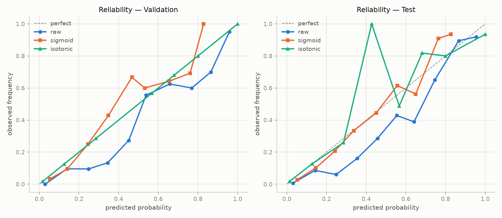

# Near-Miss Model Calibration Report — Phase 4

## Scope

This phase evaluates the existing Phase 3 DTC-FM near-miss/conflict models,
calibrates their probabilities, and selects a probability-producing model for
later risk fusion. No risk engine, confidence engine, accident fusion, or
traffic-signal control is built here.

## Label Semantics

DTC-FM label semantics remain **unconfirmed**. All metrics and outputs use
neutral `class_0` and `class_1`. Do not interpret `class_1` as
'near-miss', 'accident', or 'dangerous' without authoritative documentation.

## Split Integrity

Verified before evaluation: train/validation/test unchanged, no duplicate
group crosses splits, no sample_index overlap, no identical feature rows
crossing splits. See `split_report.md` for Phase 3 methodology.

## Primary Model

- Original model: `random_forest_A`
- Calibration method selected: **sigmoid**
- Selection basis: sigmoid chosen for stability: isotonic had lower validation Brier+log_loss but MCE~0 indicating overfit on the small validation set
- Calibration fitted on: `validation`
- Calibration samples: 376
- Saved artifact: `models\near_miss\random_forest_A_calibrated.joblib`

## Calibration Metrics

| method | validation_brier | test_brier | validation_log_loss | test_log_loss | validation_ece | test_ece | validation_mce | test_mce |
| --- | --- | --- | --- | --- | --- | --- | --- | --- |
| raw | 0.096016 | 0.099755 | 0.308279 | 0.32127 | 0.078816 | 0.086362 | 0.211035 | 0.252102 |
| sigmoid | 0.088684 | 0.089807 | 0.298774 | 0.301506 | 0.046262 | 0.043901 | 0.199698 | 0.14545 |
| isotonic | 0.080224 | 0.091872 | 0.250184 | 0.618604 | 0.0 | 0.02753 | 0.0 | 0.5724 |

**Interpretation:** lower Brier and log-loss indicate better probability
quality. Calibration selection is based on validation metrics; test metrics
are reported for final confirmation only.

## Reliability Diagram

Bin counts by method (validation, uniform 10 bins): {'raw': [129, 52, 42, 30, 22, 9, 16, 15, 20, 41], 'sigmoid': [183, 63, 24, 14, 3, 15, 14, 26, 34, 0], 'isotonic': [175, 80, 21, 0, 0, 30, 25, 0, 10, 35]}

Bin counts by method (test, uniform 10 bins): {'raw': [141, 35, 33, 31, 28, 14, 18, 20, 19, 37], 'sigmoid': [180, 49, 29, 18, 18, 13, 16, 22, 31, 0], 'isotonic': [171, 71, 27, 0, 1, 43, 22, 0, 10, 31]}

## Raw vs Calibrated Test Classification (threshold 0.50)

| Metric | Raw | Calibrated |
|---|---|---|
| Accuracy | 0.8670 | 0.8777 |
| Precision | 0.7130 | 0.8049 |
| Recall | 0.8021 | 0.6875 |
| F1 | 0.7549 | 0.7416 |
| ROC-AUC | 0.9290 | 0.9290 |
| PR-AUC | 0.8304 | 0.8304 |
| TP/TN/FP/FN | 77/249/31/19 | 66/264/16/30 |

## Calibration Method Comparison Notes

- Raw Random Forest probabilities are ranked scores that tend to be
  under-confident near the extremes and over-confident in the mid-range.
- Sigmoid (Platt) calibration fits a single-parameter logistic mapping; it
  is smooth and stable but may underfit complex miscalibration patterns.
- Isotonic regression is non-parametric and can fit more complex shapes,
  but with small calibration sets (n=376) it risks overfitting. Here it
  achieved MCE~0 on validation, so the smoother sigmoid mapping was selected
  for stability even though isotonic had a slightly lower validation score.

## Files Produced

- `reports/near_miss/calibration_report.md`
- `reports/near_miss/calibration_comparison.csv`
- `reports/near_miss/threshold_analysis_calibrated.csv`
- `reports/near_miss/error_analysis.md`
- `reports/near_miss/robustness_analysis.md`
- `reports/near_miss/probability_contract.md`
- `models/near_miss/random_forest_A_calibrated.joblib`
